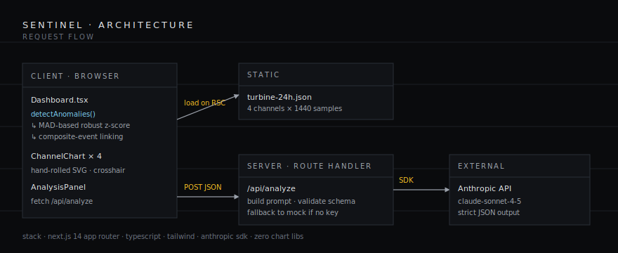

# SENTINEL

**Multi-channel sensor anomaly workbench with AI-driven decision support.**

A frontend-heavy reference application for the kind of internal tooling a reliability engineer might actually live in: a dense time-series dashboard that flags statistical anomalies on rotating-equipment telemetry, then synthesizes a structured decision brief — severity, ranked hypotheses, recommended actions — by handing the window's stats and detected events to a language model under a strict JSON contract.

<p>
  
</p>

---

## What this is

A Next.js 14 single-page workbench. The bundled dataset is 24 hours of synthetic 4-channel turbine telemetry (vibration X/Y, bearing temperature, shaft RPM) at 1-minute resolution. Four realistic faults are injected at known offsets — bearing wear, cooling degradation, governor instability, and a composite vibration-plus-thermal event — so the detection and analysis pipeline has something to find on first load.

The interaction model is meant to feel like instrumentation, not a chatbot:

1. **Scrub** a time window with the brush at the bottom.
2. **Inspect** anomalies in the right-hand registry or directly on the charts.
3. **Run analysis** to get a structured brief grounded in the current window's actual numbers.

## Features

- **Robust anomaly detection** — Sliding-window median + MAD (robust to outliers) with a 3.2σ threshold. Cross-channel events are linked into composite anomalies that escalate severity.
- **Four hand-rolled SVG channel charts** — No chart library, no canvas. Nominal bands, anomaly highlights, hover crosshair with channel-aware formatting, axis ticks every 4 hours.
- **Draggable brush** — Left handle, right handle, body-drag, and click-to-recenter. Anomaly markers visible across the full 24-hour overview.
- **Decision-support brief** — `POST /api/analyze` returns a strict JSON object: `{ headline, severity, confidence, hypotheses[3], actions[] }`. Schema is validated server-side; malformed model output falls through to the deterministic mock so the UI never breaks.
- **Works without an API key** — When `ANTHROPIC_API_KEY` is unset, the route returns a context-aware mock (e.g. composite vibration + temperature → bearing-wear hypothesis). Deployment is impressive on day zero; adding a key upgrades it from "demo" to "real".
- **Filterable severity** — Three-level severity chips (CRIT / WARN / INFO) toggle visible anomalies on both the registry and the charts.
- **Production build is 7.4 kB** for the route, 94 kB first-load JS shared chunks included. No bloat.

## Stack

| Layer | Choice | Why |
|---|---|---|
| Framework | Next.js 14 (App Router) | Server components for data loading, route handlers for the AI proxy, zero-config Vercel deploy. |
| Language | TypeScript, strict | Schema lives in `lib/types.ts` and crosses the wire end to end. |
| Styling | Tailwind + CSS variables | Tokens centralized in `globals.css`; Tailwind for spacing/layout only. |
| Typography | IBM Plex Sans + Mono + Serif | Engineering provenance, real tabular numerals, italic display face for the AI headline. |
| Charts | Hand-rolled SVG | Recharts / Victory output is recognizable on sight. SVG primitives give full control of ticks, grid, and crosshair behavior. |
| Model | Anthropic `claude-sonnet-4-5` | Strict JSON system prompt + server-side schema validation + mock fallback. |

## Run locally

Requires Node 18.18+ (Node 20 recommended).

```bash
git clone https://github.com/<you>/sentinel.git
cd sentinel
npm install
cp .env.example .env.local   # optional — leave ANTHROPIC_API_KEY blank to use the mock
npm run dev
```

Open <http://localhost:3000>.

The bundled dataset is committed at `public/data/turbine-24h.json`. To regenerate it (with the same seed) or change fault parameters:

```bash
npm run data
```

## Deploy to Vercel

1. Push the repo to GitHub.
2. In the Vercel dashboard: **Import Project** → select the repo. Framework preset auto-detects as Next.js.
3. **Environment Variables**: optionally set `ANTHROPIC_API_KEY`. The app deploys and runs whether or not it's present.
4. Deploy. The route handler at `/api/analyze` runs on Vercel's Node runtime.

## Project layout

```
sentinel/
├── app/
│   ├── api/analyze/route.ts   POST endpoint, Anthropic call + mock fallback
│   ├── globals.css            Theme tokens, typography, scrollbar, chips
│   ├── layout.tsx
│   └── page.tsx               RSC entry — loads dataset, hands to client
├── components/
│   ├── Dashboard.tsx          Orchestrates selection state
│   ├── Header.tsx             Wordmark, asset id, status pill, live clock
│   ├── MetricStrip.tsx        4 channel cards with sparklines
│   ├── ChannelChart.tsx       Single-channel SVG chart
│   ├── Brush.tsx              Draggable range selector
│   ├── AnomalyList.tsx        Registry with severity filter
│   └── AnalysisPanel.tsx      AI brief renderer
├── lib/
│   ├── anomaly.ts             MAD-based detection + composite linking
│   ├── data.ts                Server-side dataset loader
│   ├── format.ts              Tabular number / time formatting
│   └── types.ts               Shared types (client and server)
├── public/data/turbine-24h.json
├── scripts/generate-data.mjs  Deterministic synthetic data generator
└── docs/architecture.svg
```

## Design notes

A few deliberate choices worth flagging:

- **Detection is client-side.** The dataset is small (1,440 × 4 = 5,760 floats) and the algorithm is cheap. Running in the browser keeps the workbench feeling live and makes future "drag a CSV in" work mechanical, not architectural.
- **Robust z-score, not z-score.** Mean/std is sensitive to the very anomalies you're trying to find. Median + MAD gives a baseline that doesn't get poisoned by the events themselves. The MAD is scaled by 1.4826 to be a consistent estimator of σ under Gaussian noise.
- **Composite linking is a separate pass.** Two anomalies on different channels whose index ranges overlap by ≥ 3 samples are flagged composite and bumped one severity tier. This is what surfaces the bearing-wear case automatically.
- **JSON contract over freeform prose.** The model returns a typed object the UI consumes as data, not text it has to parse. Validation is in the route handler; failures fall through silently to the mock.
- **The mock is intentionally good.** A demo that requires a paid API key to be impressive is a demo that doesn't get clicked. The fallback inspects the anomaly payload and returns hypotheses appropriate to the channels involved.

## License

MIT.
